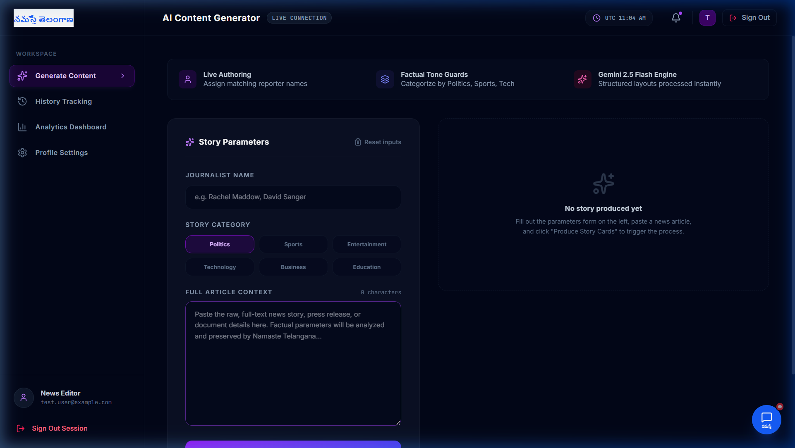

<<<<<<< HEAD
# AI Story Summarizer for Social Media Cards

An advanced, high-fidelity content assistant designed for journalists and content creators. It automates the extraction, summarization, and branding of news stories into social-ready media card designs, tailored specifically for platforms like Twitter/X and Instagram/Facebook.

---

## 🚀 Key Features

*   **Custom Database-backed User Auth**: Secure user registration and authentication backed by database persistence. Password data is hashed using `bcrypt` (using salt rounds) with unique, cryptographically random session tokens stored in the `sessions` database (30-day session expiry).
*   **Google Gemini AI Engine**: Powerful content synthesis leveraging the official `@google/genai` SDK. Summarizes long-form text, identifies core quotes, and suggests relevant hashtags.
*   **Exponential Backoff Retry Strategy**: High-reliability network handlers with a 5-retry strategy and exponential backoff to handle transient availability issues (HTTP 503/UNAVAILABLE) gracefully.
*   **Branded Card Generator**: Live, responsive preview of branded card designs (featuring custom templates like the "Namaste Telangana" layout) with instant high-quality card downloads powered by `html2canvas`.
*   **Data Isolation**: Complete, multi-tenant database partitioning ensuring users can only view, manage, and download their own history of generations.

---

## 🛠️ Technology Stack

*   **Frontend**: React.js, Tailwind CSS (Vite client bundling), Lucide React (Icons), Framer Motion (Animations)
*   **Backend**: Node.js, Express, Drizzle ORM (Database query layer)
*   **Database**: PostgreSQL (Production) with automatic file-based fallback to `local_db.json` for seamless local development
*   **AI Integration**: Official `@google/genai` SDK (Gemini models)

---

## ⚙️ Environment Configuration

Create a `.env` file in the root directory and configure the following variables:

```bash
# Gemini API Key (Required)
GEMINI_API_KEY="your-gemini-api-key-here"

# App Base URL (For Client Routing)
APP_URL="http://localhost:5000"

# PostgreSQL Configuration (Optional - Falls back to local_db.json if empty)
SQL_HOST=
SQL_DB_NAME=
SQL_USER=
SQL_PASSWORD=
SQL_ADMIN_USER=
SQL_ADMIN_PASSWORD=
```

---

## 💻 Local Installation & Usage

### 1. Clone & Install Dependencies
```bash
git clone https://github.com/JoelAstro/NAMASTE-TELANAGANA.git
cd NAMASTE-TELANAGANA
npm install
```

### 2. Running Monolithic Mode (Single Command)
Starts both the Express API backend and Vite client bundled together on a single port:
```bash
npm run dev
```
Open **`http://localhost:5000`** in your browser.

### 3. Running Standalone Modes (Separate Services)
If you wish to run the client and backend as separate processes during development:

*   **Backend standalone** (Runs API on port `5000`):
    ```bash
    npm run dev:backend
    ```
*   **Frontend client standalone** (Runs Vite dev server on port `5173` with automatic API proxying):
    ```bash
    npm run dev:frontend
    ```
    Open **`http://localhost:5173`** in your browser.

---

## 📸 Screenshots

Here is the production-ready dashboard interface:



---

## 🧑‍💻 Author

*   **Joel** (JoelAstro)
*   Developed as a production-grade content assistant for Namaste Telangana.
=======
# NAMASTE-TELANAGANA
AI Story Summarizer for Social Media Cards is an AI-powered newsroom platform that converts full news articles into concise summaries, pull quotes, and engaging social media captions using Gemini AI. Features secure authentication, generation history, analytics dashboards, export tools, and responsive multi-user content workflows.
>>>>>>> b3de0a2830b05c9a8ce353a4505b99764a351d2b
